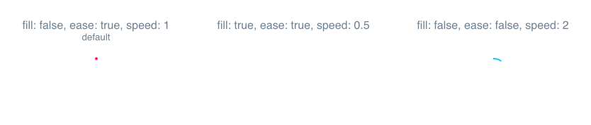

SVG Spinners
============

**SVGs are awesome!** They're resolution independent, pretty lightweight, stylable and animatable. This makes them perfectly suited for loading indicators (aka spinners).

This repository is a collection of beautiful svg spinners that are fully costumizable to your corporate identity via CSS.

### We want your spinner!

There aren't many spinners yet which is why we need your help! If you created a svg spinner please consider contributing and sharing your precious work with other designers and developers. A backlink to the author in the README is highly welcome of course.

Please note that in this case your spinner will be published under the [Unlicense](http://unlicense.org/).

ArcSpinner
----------
by [jhnns](https://github.com/jhnns/)



### Example

```css
.spinner-path {
    stroke-width: 10px;
    stroke-linecap: round;
    stroke: rgb(255, 27, 86);
    shape-rendering: optimizeSpeed;
    fill: none;
}
```

```javascript
var spinner = new ArcSpinner();

spinner.start({
    fill: false,
    speed: 1,
    ease: true
});

document.getElementById("spinner-container")
    .appendChild(spinner.node);
```

The ArcSpinner doesn't come with any predefined styles so be sure to apply some via CSS. Check out [example/arc.html](https://github.com/peerigon/svg-spinners/blob/master/examples/arc.html) for inspiration.

### API

#### ArcSpinner(namespace="spinner": String)

Creates a new instance with `namespace` as css class name. Defaults to `spinner`. If you choose `my-namespace` for example, the `<svg>`-element will have `my-namespace` as class name and the `<path>`-element will have `my-namespace-path`.

#### .node: SVGElement

A reference to the SVGElement. You should inject it into a container which gives you [full flexibility to control the size](http://stackoverflow.com/a/25941018/1343851) of the spinner. See [example/arc.html](https://github.com/peerigon/svg-spinners/blob/master/examples/arc.html).

#### .start(options: Object)

Starts the animation. Valid options are:

- `fill` (default `false`)<br>
Whether the arc should be filled with color or not. This option does **not** apply the necessary styles. It just modifies the drawing commands so the shape can be filled with the css `fill`-property.

- `speed` (default `1`)<br>
In turns per seconds.

- `ease` (default `true`)<br>
Whether the movement should be eased at the beginning and the end. Setting it `false` makes it linear.

#### .stop()

Cancels the animation. Call this everytime the spinner is not visible to save CPU cycles.

<br>

Compatibility
-------------

The svg spinners require some new DOM features (such as [`requestAnimationFrame()`](https://developer.mozilla.org/en-US/docs/Web/API/window.requestAnimationFrame)) so be sure to add the required polyfills.

<br>

License
-------

Unlicense

Sponsors
-------

[](https://peerigon.com)

